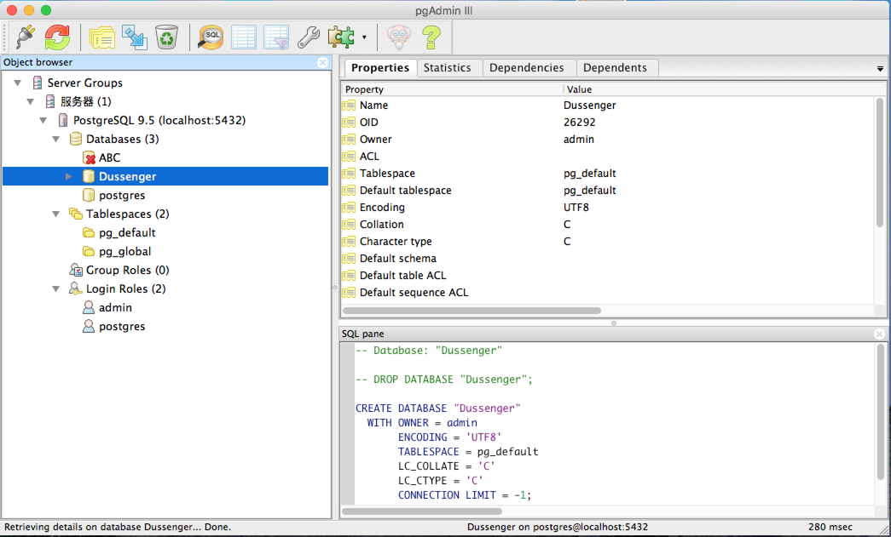
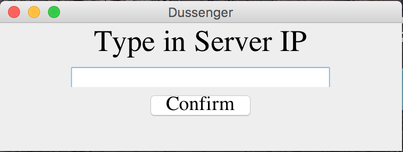
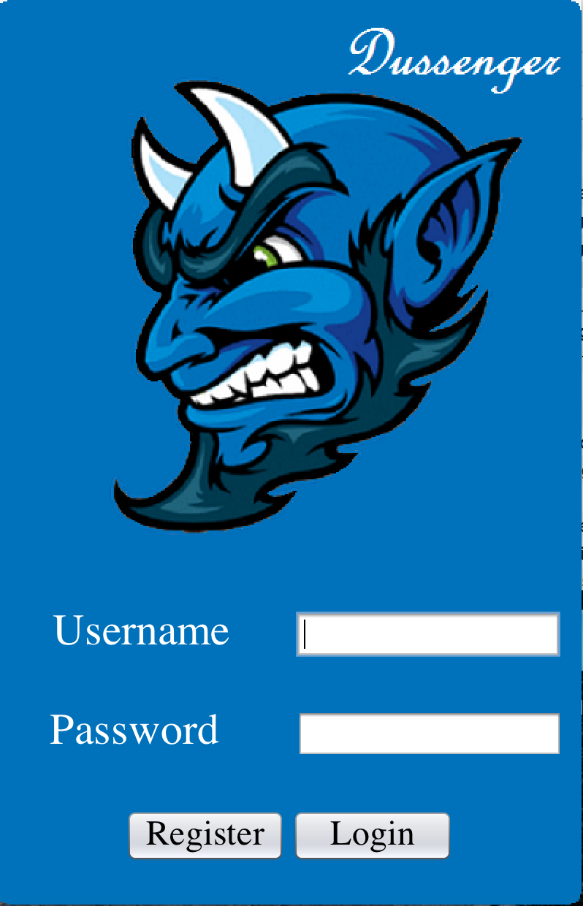
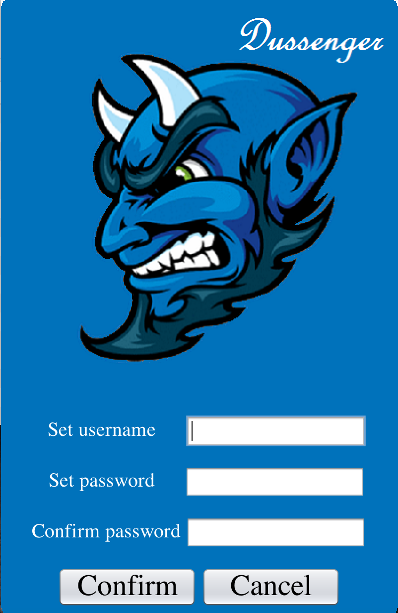
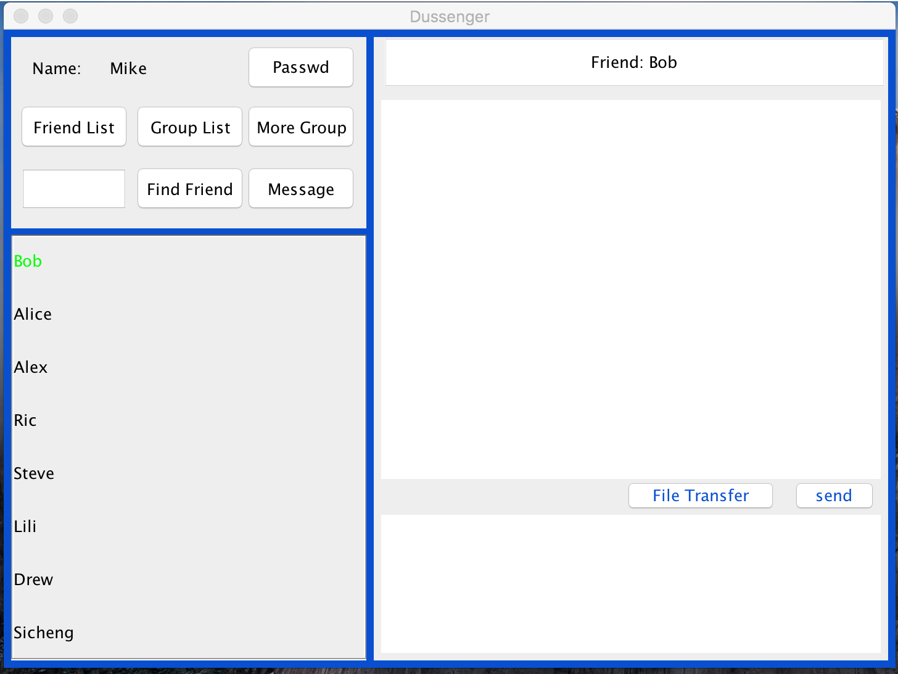
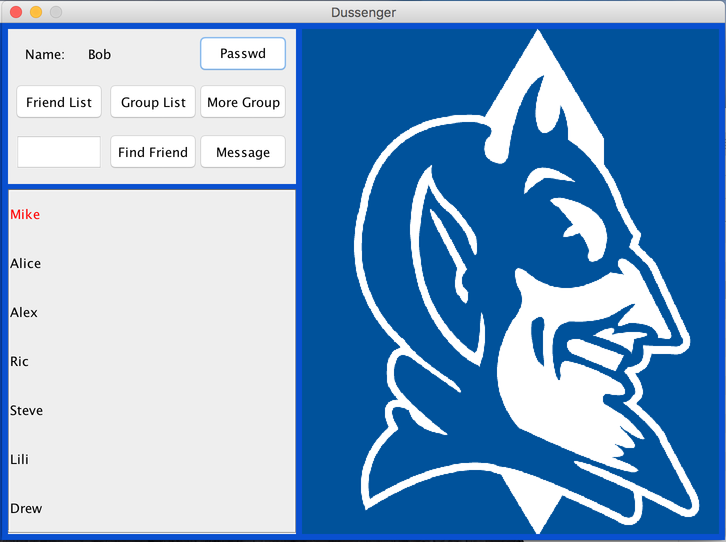
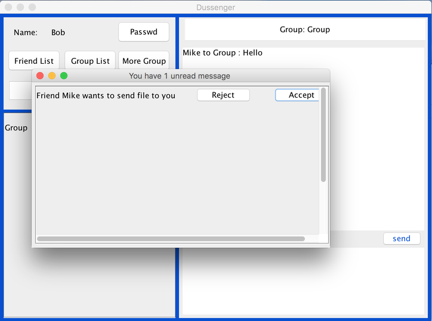
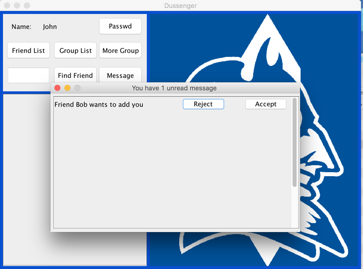
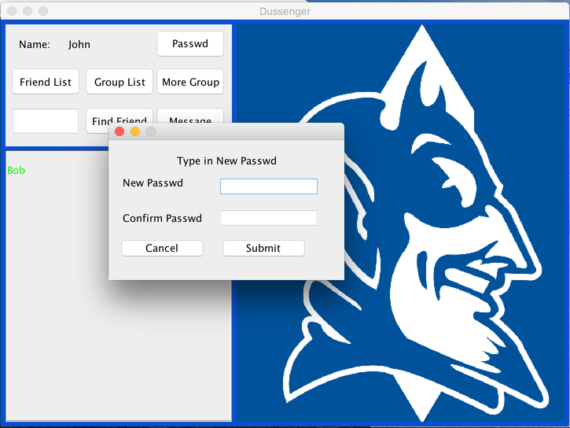

# Dussenger

Desktop Messenger built on Java, which implements features such as group chatting and file transfer.

## 1 Getting Started

These instructions will get you a copy of the project up and running on your local machine for development and testing purposes. See deployment for notes on how to deploy the project on a live system.

### 1.1 Prerequisities & Installing
In order to run the sever on your computer, you need a computer that run Mac OS or Linux.

Also, you need to download postgresql from http://www.postgresql.org/download/.

Then you need to create a Database named as **Dussenger** ,a login role named as **admin** and set login role's password to **ECE651**

All those things above can be done in the Postgresql user interface.

### 1.2 Initialization

The first time you run the server you need to uncommon the **initialize()** line in the main function in Server.java file.

**intialize()** function will set up the database, create the table you will use and set several default users in the Database.

After you initialize your database, you need to common **initialize()** line again.

The default user is **"Mike","Bob","Alice","Alex","Ric","Steve","Lili","Drew"** , they are all friends between each other and having the password equal to their user name.

### 1.3 Run

Every time you run a client you need to type in the server's IP and connect to it. Then you can register and login.

After you connect to the server, you can choose to login or register a new user.

## 2 Features

This part will introduce some features about this software.

### 2.1 Online Friend

The client software enables user to see whether their friend is online of not.

The following image shows that, when Bob is online, his friend Mike can see from the Friend list.

### 2.2 Unread Message Notification
If Mike send Bob a meesage, but Bob doesn't read, the software will turn Mike's name to red.

When Bob receive an unread group message, the group name will turn red in the same way.

If Bob's main is in the friend list part (as image shows), he receive a group message, the **Group List** button will also turn red. The **Friend List** button has the same feature.

### 2.3 File Transfer
The software also enable user to transfer file to others.

### 2.4 Message Table
Enables user to deal with important message, such as file transfer and add friend request.
Click the Message button, you can see your unread important messages.
The server will retain these kinds of message if the target users are offline and send the message to target users when they are online.

### 2.5 Reset Password
Click the Password button, you can reset your password.

### 2.6 Group Related Function

* Create new group
* Check group member
* Dismiss group

### 2.7 Friend Related Function

* Add / Delete friend
* Invite friend to existing group